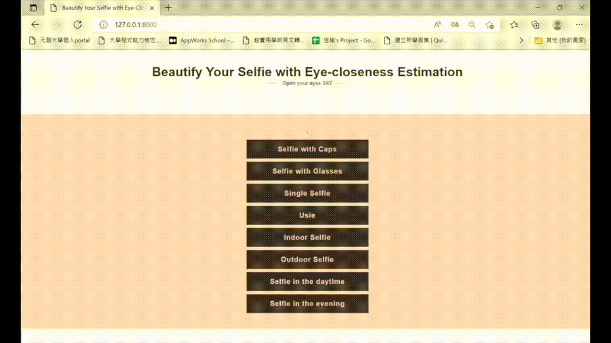

# BeautifyYourSelfie
Beautify Your Selfie with Eye-closeness Estimation

## Introduction
The selfie is definitely one of the most prominent cultural phenomena of the 21st century. Everyone always wants his/her state perfect in that tiny square. However, even though we try our best to keep everything good when we take a selfie, there is something we can't control. For example, our blinking behavior. This natural behavior usually makes our eye closed in selfies. Thus, we developed Beautify Your Selfie with Eye-closeness Estimation. It is a system that aims to repair your eye_closeness in your selfiie with eye landmark detection and image fusion. 

Keyword: image processing; eye detection; computational geometry.

## Prerequisites
- python == 3.7.4
- boost == 0.1
- cmake == 3.20.3
- Django == 3.2.4
- dlib == 19.22.0
- face-recognition-models == 0.3.0
- imutils == 0.5.4
- numpy == 1.16.5
- opencv-python == 4.5.2.52
- requests == 2.22.0

## Structure
Roughly speaking, this project can be divided into two parts: 

- **Closed-eye repair algorithmn:** The concept behind this algorithmn is to detect the position of eyes at first. And then, calculate the area of them. In the end, it uses the masks made with the area to repair eye-closeness.
- **Web interface:** To better demonstrating our work, we conbined our system and Django web framework. As a result, you can see the results we did from the website.

## Getting Started
Set up all prerequisites

Download the eye landmark detection model with the following link: [https://github.com/italojs/facial-landmarks-recognition/blob/master/shape_predictor_68_face_landmarks.dat](https://github.com/italojs/facial-landmarks-recognition/blob/master/shape_predictor_68_face_landmarks.dat)
and put it in `.\`.

Execute the follwing commands:

    $ git clone https://github.com/bigmms/BeautifyYourSelfie.git
    $ cd Beautify Your Selfie with Eye-Closeness Estimation
    $ python manage.py runserver
    >> Run the local server and go to http://127.0.0.1:8000/

The results will be saved in `.\app\static\caseX\`.

## Results
Below are our results in eight different situations:

## References
[https://www.pyimagesearch.com/2017/04/10/detect-eyes-nose-lips-jaw-dlib-opencv-python/](https://www.pyimagesearch.com/2017/04/10/detect-eyes-nose-lips-jaw-dlib-opencv-python/)

[https://medium.com/@lin7lic/python3-django2%E7%B0%A1%E6%98%93%E4%B8%8A%E5%82%B3%E6%AA%94%E6%A1%88%E7%B6%B2%E9%A0%81-4e4e24c556c0](https://medium.com/@lin7lic/python3-django2%E7%B0%A1%E6%98%93%E4%B8%8A%E5%82%B3%E6%AA%94%E6%A1%88%E7%B6%B2%E9%A0%81-4e4e24c556c0)

[https://developers.google.com/workspace/guides/create-project](https://developers.google.com/workspace/guides/create-project)
